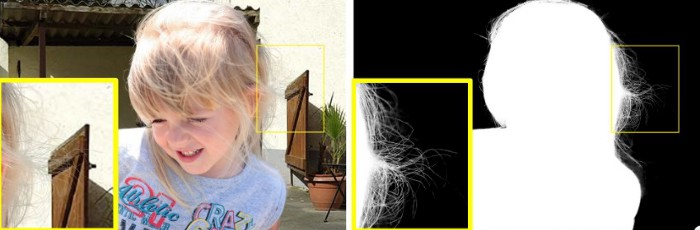
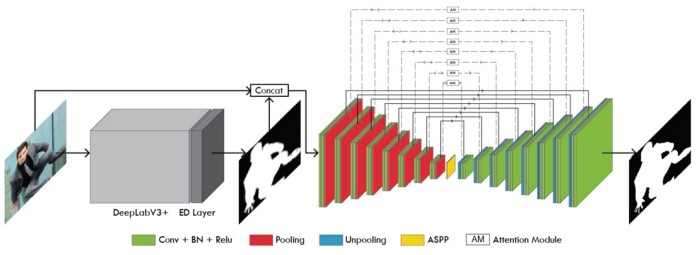
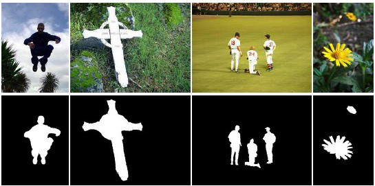
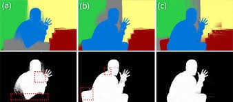

## The Problem and Computer Vision To The Rescue
Nowadays, realistic editing of photographs demands a careful treatment of color blends that frequently occur in natural scenes. These color blends are typically modeled through a soft selection of scene or object colors. Therefore to achieve a high-quality image editing and background composition, accurate representation of these soft transitions between image regions is essential. The majority of the present techniques used in the industry for generating such representations are heavily dependent on some kind of user interaction by skilled visual artists. So creating such accurate saliency selection becomes an expensive and tedious task. To fulfill this void of skilled visual artists, we utilize computer vision to simulate the human vision system which has an effective attention mechanism for determining the most salient information from visual scenes. Such a kind of problem can also be interpreted as a foreground extraction problem, where the salient objects are considered as a foreground class and the remaining scene is the background class. Computer vision and deep learning aim to model such a mechanism through some selective research branches namely image matting, salient object detection, eye-fixation detection, and soft segmentation. It is also important to note that unlike computer vision, deep learning is mostly a data-intensive research approach.
With the recent rise in the use of fully convolutional networks (FCN) for image segmentation, deep learning has significantly improved the foreground extraction and saliency detection baselines. Despite all these improvements, most of the suggested architectures use network backbones that were originally designed for image attribute classification tasks, which extract representative features that are of semantic signification rather than global contrast and local detail information. But in this blog, we will leave this issue to be discussed in more detail in my later blogs.

## Is it a Segmentation problem?

Yes, it’s a segmentation problem if we look at it from the angle of our output format. In recent years, semantic segmentation has become a key problem in the field of computer vision and deep learning. Thus looking at the bigger scenario, we can say that semantic segmentation is one of the key tasks in its field that paves the way towards better scene understanding. The significance of scene understanding is also highlighted by the evidence of an increasing number of applications that nourishes from inferring cognitive facts from images and videos.
The three approaches we discuss for achieving a smooth and perceptually sound fine-grained semantic segmentation are:
- Image Matting
- Salient Object Detection (SOD)
- Soft Segmentation

## Image Matting


Image matting can be understood as a generalized version of green-screen keying used for precise estimation of foreground opacities in an unconstrained setting. Image matting is a very important topic in both computer graphics and vision applications. Earlier approaches to image matting involved large sparse matrices such as large kernel matting Laplacian and its optimization. However, these methodologies of solving such linear systems are often very time consuming and unfavoured by users. Many pieces of research tried to improve this linear system solving speed by using adaptive kernel sizes and KD-tree, but no significant improvement was observed in terms of quality on wild images and inference speed. Since the problem is highly ill-posed, a trimap (or strokes) indicating definite foreground, definite background, and unknown regions is usually given by the user as a supportive input.



Let’s first formulate a basic equation for image matting. Denoting an image pixel’s background color, foreground color, and foreground opacity (alpha matte) as B, F and α respectively, the pixel’s color C can be written as a convex combination of B and F:
```
C = F (α)+ B(1 − α).
```
Image matting methods can be categorized into three major types, propagation-based, sampling-based, and learning-based. In some approaches, a hybrid combination of sampling-based and propagation-based matting is also used.
Sampling-based image matting is based on an assumption that the true background and foreground colors of the uncharted pixels can be derived from the known background and foreground pixels that are localized near that unknown pixel. Some sampling-based methods are:
- Shared sampling matting
- Iterative matting
- Bayesian matting
- Sparse coding
Propagation-based image matting techniques calculate the alpha values of the uncharted pixels by propagating the alpha values of the known local background and foreground pixels into the unknown regions. However, in the case of wild background images, the over-dependency on color knowledge leads to artifacts in images where the distribution of background and foreground color overlap. Some propagation-based methods are:
- Geodesic matting
- Close-form matting
- Poisson matting
- Spectral matting
Nonetheless, both sampling and propagation-based techniques are unable to provide satisfactory and completely automated results. Thus, recently, several deep learning studies have suggested approaches that either solve the above mentioned linear system through a concatenated input of trimap and RGB image into FCN or just the RGB image itself to predict final alpha matte. Some known trimap dependent deep learning architectures are:
Deep Automatic Portrait Matting by Shen et al.
Deep Image Matting ( DIM ) by Xu et al.
Disentangled Image Matting by Cai et al.
Whereas some trimap independent deep learning architectures are:
Late Fusion Matting by Zhang et el.
Semantic Human Matting by Chen et al.
AlphaNet: An Attention Guided Deep Network for Automatic Image Matting by Sharma et al.

In my personal experience, deep learning-based approaches are able to capture global semantic information and local details better than the other two approaches, also they are not biased on any crude assumption of the existence of a correlation between the known and unknown region pixels.

## Salient Object Detection (SOD)
SOD's major objective is to segment the most salient (important) and visually attractive object in the picture. Many fields such as image segmentation and visual tracking apply SOD in a variety of applications. Similar to image matting, after the rise of Fully Convolutional Networks (FCN) for saliency detection, SOD state-of-the-art has improved significantly.

Unlike Natural Image Matting, salient object detection is not as complex as it seems. The major challenges in achieving a precise salient object detection are:
(1) The Saliency Localization. The saliency of a particular visual asset is generally defined over the global contrast of the entire image rather than any pixel-wise or local feature. Therefore, in order to achieve a precise SOD, the saliency detection algorithm must not only capture the global contrast of the whole image but also establish an accurate representation of the detailed structures of the foreground object. To tackle this problem, multi-level deep feature aggregation networks are used.
(2) The Absence of Boundary Refinement Losses. The most common loss used for training saliency object detection models is either Intersection over Union (IoU) loss or Cross-Entropy (CE). But both of them lead to a blurry boundary detailing due to their incipiency of efficiently differentiating boundary pixels. Many studies also use the Dice-score loss, but its major purpose is to handle the biased training sets and not specifically enforcing the modeling of fine structures.
### Research History
There has been a rich modern history of deep learning literature for salient object detection. Some studies emphasize on the use of deep recurrent networks with attention mechanisms for iterative refinement of some selective image sub-regions. On the other hand, some studies highlight the effectiveness of global information transfer from the deep layers of the network to the shallow end by a deep multi-path recurrent connection. Many authors like Hu et al.[1] and Wang et al.[2] proposed methods that either uses recurrent fully connected networks or recurrently concatenated multi-layer deep features for salient object detection. These studies also show the effectiveness of iterative correction of prediction errors. In contrast to the previously mentioned research works, a few pieces of research also showed the use of a contextual attention network in U-Net architecture for predicting the pixel-wise attention maps. These extracted pixel-wise attention maps are proved very effective for saliency detection in terms of evaluation metrics. Few proposed methods emphasize on coarse to fine prediction transitioning. These methods propose refinement strategies for achieving more accurate boundary details by capturing finer structures. For example, Lu et al. proposed an architecture that captures a deep hierarchical salient representation for modeling various global structured saliency cues of the saliency maps along with a post-refinement stage. The latest published advancement in the field of salient object detection (as I write this blog) is by Qin et al. who suggest a powerful deep network architecture (U2-Net) with a two-level nested U-structure. The key improvements stated by the authors are multi-scale contextual information captivity (a mixture of receptive fields) and increased network depth (pooling in ReSidual U-blocks) without any significant computational expense.

In my personal experience, SOD also achieves higher quality saliency maps as natural image matting but an inferior quality in terms of transparency modeling and fine-structure extraction.

## Soft segmentation
Soft segmentation is defined as the decomposition of the image into two or more sections where each member pixel may own membership into two or more sections.

### Research History
Most of the earlier soft segmentation methods emphasize on the extraction of soft saliency maps of various homogeneous colors using either per-pixel color unmixing or global optimization. Although these extracted soft color maps are observed to be useful for many critical image editing applications such as image recoloring but similar to SOD they do not specifically respect object boundary and transition region granularity. It is interesting to note that image matting has a very close relationship with the branch of soft segmentation. In fact, some pieces of image matting literature such as Matting Laplacian are completely aligned with the key idea of soft segmentation, which is capturing a powerful representation for the local soft transition regions in the image. Given a set of user-defined regions, these methods mainly work on the idea of iteratively solving a two-layer soft segmentation problem to generate multiple layers. The work of Levin et al. on spectral matting also serves the same purpose by estimating a set of spatially connected soft segments automatically via spectral decomposition. Recent soft segmentation research by Aksoy et al. also follows the idea of spectral matting in combination with spectral decomposition and matting Laplacian. However, unlike spectral matting, their work approaches the problem from a spectral decomposition angle by fusing the local texture information with the high-level features from a deep convolutional neural network trained for scene analysis. One of their key contributions is the use of the graph like structure to enrich the eigenvectors of the corresponding Laplacian matrix by semantic objects as well as the soft transitions between them.

In my personal experience, soft segmentation is a derived branch of natural image matting that combines the rich history image matting practices with the power of deep learning. Also unlike vanilla image matting, soft segmentation gives more layers of output that represent the semantically meaningful regions. But despite all these significant improvements, there remains a huge scope of improvement that still needs to be solved.

## Conclusion
I have explained these approaches from a point of view of solving the problem of salient foreground extraction, but the actual problem which these methods aim to solve is very diverse and enriched in their respective research branches and contribute to the domain of Deep Computer Vision (my take on Computer Vision + Deep learning) in their way.

This blog gives an overview of all these approaches and honestly from a researcher's perspective, we have not even properly scratched the surface of these topics. To read in detail about matting check out AlphaNet, and I may discuss these topics in a more dive deep manner in my future blogs.

### Read more 📖

- [Blog](https://rishab.co/blog)

🙏 Thanks for reading! hope you liked the post.
Have a nice day bye! 👋

*Comment down if you want to know more*