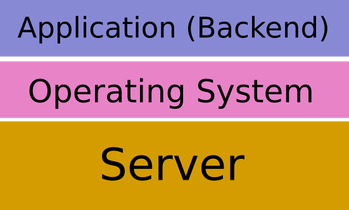
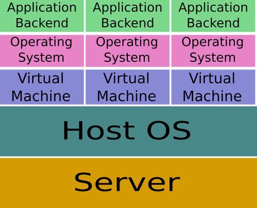
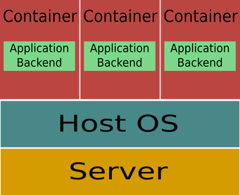

This post is a brief guide to install Hasura Local Development on the Linux System and explains the concepts associated with it.

---
##Docker
Docker is a platform for developing, shipping and running applications using container based virtualisation technology. To understand container virtualisation technology we will have to travel down the memory lane to the dark ages when each application was deployed on a separate physical server machine, and how that has changed over the years. This is how deployment was done in those days.

The problems with this approach are numerous
1. Purchasing a separate server for every application was not cheap.
2. Scaling of an application becomes costly.
3. Deploying takes time because of the fact that procuring and setting up a server machine is both time consuming as well as costly.
In order to solve this problem Hypervisor based virtualisation was developed. This approach allowed multiple virtual machines to run on a single physical machine. The different virtual machines share resources provided by the physical machine like RAM, disk, processor cycles, network bandwidth and so on. Now we could run multiple applications on just one physical machine i.e. one application on one virtual machine. This did provide the benefit of cost reduction upto some extent. but there were problems with this approach as well

A hypervisor creates a virtual machine i.e. it virtualises hardware. It abstracts operating systems from the underlying host system. The operating system running on a VM is called a guest operating system. The OS of the host machine is called host OS. Now in order to create a VM we need to allocate resources to it from the host machine. This allocation takes time. Also our application running on a particular VM may not fully utilise the resources provided to that VM. This again leads to a wastage of resources. The solution to these problems was provided by Docker© Inc. in the form of “containers”. More specifically they introduced the concept of container based virtualisation.

## CONTAINER
Container based virtualisation uses the kernel on the host to run multiple instances called “containers”. Each container has its own
1. Root filesystem
2. Memory
3. Processes
4. Devices
5. Network Stack
On the outside a container looks exactly like a VM, however it takes much less deployment time and runs pretty much like a process (rather than a VM) on a host. One can think of a container as a container (literally) that isolates an application and all its dependancies from other applications or processes running on the same system. This isolation pretty much resembles that provided by a VM however a container is not a VM.


## CONTAINERS VS VMS
As opposed to VMs containers
1. Are Lightweight
2. Require less time to spin up
3. Don’t require guest OS
4. Consume less resources
5. Are more portable

### USING DOCKER TO DEPLOY CONTAINERS
The very first requirement is installing Docker on your system

```$ sudo apt-get install docker```

Now Docker platform itself has multiple products/tools
1. Docker engine
2. Docker Swarm
3. Docker Hub
4. Docker Machine
5. Docker Compose
6. Kitematic

Docker engine is the program which enables containers to be built, shipped and run. It uses Linux kernel namespaces which provide isolated workspace. It is also called docker daemon. This is the program with which we interact when running various docker commands. Docker uses a client-server architecture in which the docker daemon is the server. The user interacts with the daemon using docker client. One is essentially using the docker client when typing in a command that starts with docker like

```$ docker version```

showing the version of docker client and daemon
If you don’t want to use the CLI to interact with docker daemon, you can use Kitematic which is a GUI docker client.

## DOCKER IMAGES
Images are read only templates that are used to build containers. They contain all the information about dependancies needed, OS required, libraries and binaries required to run the container. Images can be stored on your local registry or on the public Docker Hub registry. One can build his own images and run containers using them. As far as this internship was concerned all I had to do was git push my custom code to the VM created on Hasura platform. The remote repository contained a Dockerfile in the top level directory. Building of images was handled by the platform for me. For an extensive tutorial on Docker including building images, docker swarm, docker hub and so on, check this.

##Virtualbox
VirtualBox is a powerful x86 and AMD64/Intel64 virtualization product for enterprise as well as home use. Not only is VirtualBox an extremely feature rich, high performance product for enterprise customers, it is also the only professional solution that is freely available as Open Source Software under the terms of the GNU General Public License (GPL) version 2.
VirtualBox may be installed on a number of host operating systems, including: Linux, macOS, Windows, Solaris, and OpenSolaris. There are also ports to FreeBSD and Genode.
It supports the creation and management of guest virtual machines running versions and derivations of Windows, Linux, BSD, OS/2, Solaris, Haiku, OSx86 and others, and limited virtualization of macOS guests on Apple hardware.
Uses of Virtualbox
- Running multiple operating systems simultaneously. VirtualBox allows you to run more than one operating system at a time. This way, you can run software written for one operating system on another (for example, Windows software on Linux or a Mac) without having to reboot to use it. Since you can configure what kinds of “virtual” hardware should be presented to each such operating system, you can install an old operating system such as DOS or OS/2 even if your real computer’s hardware is no longer supported by that operating system.
- Easier software installations. Software vendors can use virtual machines to ship entire software configurations. For example, installing a complete mail server solution on a real machine can be a tedious task. With VirtualBox, such a complex setup (then often called an “appliance”) can be packed into a virtual machine. Installing and running a mail server becomes as easy as importing such an appliance into VirtualBox.
- Testing and disaster recovery. Once installed, a virtual machine and its virtual hard disks can be considered a “container” that can be arbitrarily frozen, woken up, copied, backed up, and transported between hosts.
- On top of that, with the use of another VirtualBox feature called “snapshots”, one can save a particular state of a virtual machine and revert back to that state, if necessary. This way, one can freely experiment with a computing environment. If something goes wrong (e.g. after installing misbehaving software or infecting the guest with a virus), one can easily switch back to a previous snapshot and avoid the need of frequent backups and restores.
- Any number of snapshots can be created, allowing you to travel back and forward in virtual machine time. You can delete snapshots while a VM is running to reclaim disk space.
- Infrastructure consolidation. Virtualization can significantly reduce hardware and electricity costs. Most of the time, computers today only use a fraction of their potential power and run with low average system loads. A lot of hardware resources as well as electricity is thereby wasted. So, instead of running many such physical computers that are only partially used, one can pack many virtual machines onto a few powerful hosts and balance the loads between them.

What would we use virtualbox for?
We would be using Virtualbox to install Hasura Local Development on our own Linux setup. After we install Hasura Local Development, we need to start it using the terminal which invokes our own Virtualbox (virtual machine) where we need to login using our hasura account. The console can then be accessed using the dashboard provided by Hasura on their web portal.

## Minikube
Minikube is a tool that makes it easy to run Kubernetes locally. Minikube runs a single-node Kubernetes cluster inside a VM on your laptop for users looking to try out Kubernetes or develop with it day-to-day. Check the Minikube GitHub page for more information on how to install Minikube on your system.

## Hasura Platform
The Hasura platform provides developers with a bunch of backend services like authorisation, session maintenance, database etc. so that the developer does not has to reinvent the wheel each time. It can be installed locally on a machine as well as on the cloud. It comes with a database (postgres), cache (redis), webserver (NGINX) and a service for SSHing into the VM so as to deploy custom code. Detailed instructions for installing Hasura locally can be found here. One must have a 64 bit machine to do so. Nevertheless you can visit beta.hasura.io to create a free trial project and experience the power of Hasura.

### Read more 📖

- [Blog](https://rishab.co/blog)

🙏 Thanks for reading! hope you liked the post.
Have a nice day bye! 👋

*Comment down if you want to know more*