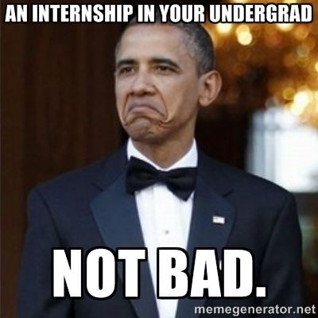
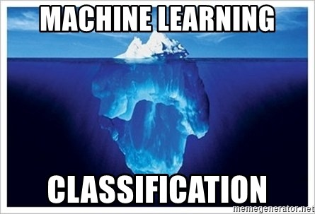
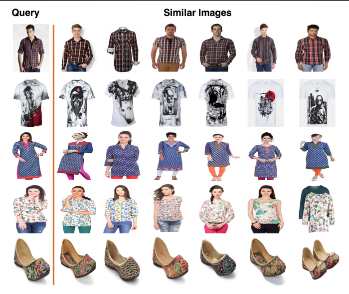
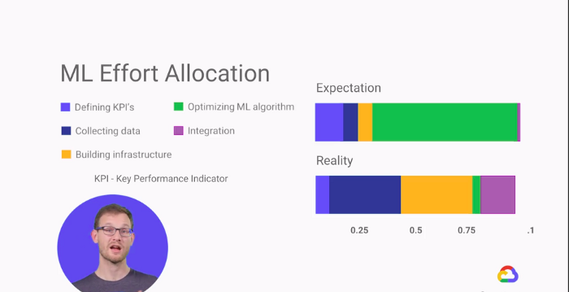
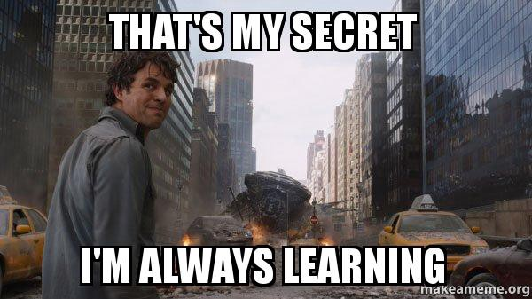

At the end of the day, the questions remain after a journey comes to an end — What have you learned? Is that what you want?

------

This question was not answered immediately, but eventually. I actually realized my learnings from the internships after a few weeks of returning back to the university. The practical experiences gave maturity in the decision making of my university level projects.

------

## Fynd Machine Learning Internship Challenge
I still vividly remember that I started applying for my third-year internships from the month of January 2018. I applied for Fynd and soon I was reached back by the HR team with an assessment challenge.
The challenge was a simple yet tricky classification problem. The problem was a basic image classification, which expected us to train a machine learning model to classify between various cloth patterns. The data was provided and consisted of a set of clean e-commerce images distributed in a balanced format under various classes. As the provided data was not much in quantity, the hint was clear that the challenge expected us to do transfer learning. I followed the hint and started fine-tuning an Imagnet pre-trained model using Keras. The code was mostly copied, as Keras already provide example cases for such classification problems. The trick was to optimize the hyperparameters for achieving the best accuracy. In order to do this, I did some research on the kind of work already published on recognizing such features and applied this knowledge to deduce the best possible hyperparameters. Even after this research, I was unable to achieve the best accuracy but a moderate accuracy of around 70%. To make my solution more exhaustive, I also trained a VGG-16 inspired network from scratch so that I could reflect back a wider perspective of solving a problem. I documented my two approaches and submitted the solution on the day of the deadline. After one week I was contacted back by the HR, informing me that I have been shortlisted for the interview round.
The interview started with an introduction to Fynd. I was told about the Fynd App and how machine learning is elevating the user experience. Firstly I was asked some basic introductory questions about me and my background. Then they asked some questions about my solution for the assessment challenge. The questions were straight to the point and assessed my explaining capability. Then I was asked some more questions about my knowledge in Python and Data Science. Overall the interview went pretty well and I was offered an internship.

## Preparation for the Internship
I started my internship preparation by reading some basic statistics books like An Introduction to Statistical Learning. That was my first touch with machine learning at the very fundamental and statistical levels. This was necessary because I wanted to revise my all concepts before handling the actual practical problems at the internship. Once I got the hang of the concepts I began to move on to one of the popular courses taught by famous Kaggler Dan Becker on Datacamp. Things were not that easy as they seemed at first, but Dan has always the natural capability to draw people’s attention despite the complexity of any concepts and simplify the concepts for digestion like no one else. Just give it a try and you will find that this buzzword is truly not that complex as it sounds. I bet.
Meantime, I was also practicing another focused area of artificial intelligence — Deep Learning. To give hindsight of what this seemingly foreign term is, please take a look at the explanation of neural networks and how neural networks are used to compute any function. If you want to get a visualization of how they work, then click here. Press the ‘Play’ button, sit back, relax, and watch how neural networks are used for classification and regression. Cool isn’t it?
The Internship
I was the first machine learning intern to join the AML+ team at Fynd.
Within the first few days, I was introduced to the amazing colleagues, various traffic terms in the industry, and the ongoing exciting projects. One of the things that I liked the most about my internship was the trust and freedom given to me as an intern to choose the project that I was interested in and just went all-in for it!
To my surprise, I realized that I was the not the first one who was pioneering the project, as the team had already deployed similar models with high accuracy in production. When somebody has done something before, certainties come in because you know what has been tried and what not. But in deep learning, these certainties seems like a black box to me as I was giving it a hit and trial approach.
In the next section, I briefly list down the workflow that I have gone through as these are what that has built my foundation in Machine Learning. And I hope you will find it useful in some ways.
### 1. Breaking down the Classification Problem
The project chosen was image classification.
However, as I have learned, asking the right questions is very important for a Data Scientist.
A lot of questions were raised to really understand the classification problem before the code started, be it data sources available, the end goals of the project. Essentially, our objective was to predict the item attribute in a given E-commerce image (like neck type, sleeve length, etc.)

### 2. Data Acquisition
Excited with the new project, I started collecting data sources from various online forums and blogs. Some helpful references were Adrian’s blog on utilizing the Bing API for making dataset and the evergreen Fatkun’s batch downloader. Collecting the right data source is similar to the case where you are scraping data from different websites for data preprocessing later. It is so important that it could affect the accuracy of the models that you are building in the later stage.
### 3. Data Preprocessing
Real world data is dirty. We can’t expect a nicely formatted and clean data as provided by Kaggle. Therefore, data preprocessing (other people might call it data munging or data cleaning) is so crucial that I can’t stress enough how important it is. In practice I realized that this stage usually occupies 40%-70% of the whole workflow, just to clean the data to be fed to your models.
``Garbage in, Garbage out``
One of the things that I like about data science is that you have to be honest with yourself. When you don’t know what you don’t know, and you think the data preprocessed is already clean enough and ready to feed to your models, therein lies a risk of building the correct models with the wrong data. In order words, always try to question yourself if the data is technically correct with the domain knowledge that you have, scrutinize the data with manual inspection to rule out any possibility of an outlier.
I was particularly careful about this after I made a mistake of feeding the models with the wrong data, just because of a simple flaw in one of the preprocessing steps.
### 4. Building Models
After some research, I tried many models to train for our task, which included VGG16, VGG19, Xception, and NASNet. For the sake of brevity, you can find a detailed explanation of each model on various websites.

Fine-tuning different models from scratch was a steep learning curve for me as a person who was still learning from MOOCs and textbooks. Fortunately, Keras (with Tensorflow backend) came to my rescue as they are easy to learn for fast models prototyping and implementation in Python. In addition, I also learned how to optimize the models and fine-tuned the hyperparameters for each model using several techniques.
### 5. Models Evaluation
To evaluate the performance of each model, I used mainly a few metrics: Mean Absolute Error (MAE), Cross Entropy Loss (CEL), and Categorical Accuracy.
The results were not really good at the beginning, but as I progressed, they got better and these evaluation metrics started to show some good performance.
## Research
The second phase of my internship was a research project. To explain my point in simple words, our research was on finding an optimal algorithm that could help us accurately retrieve images from the data that are visually similar to a particular image. For example, you have an image of a “check pattern t-shirt” as a query and you want to retrieve more variants of that product from the data. In such a case, our research comes to the rescue. Our goal was to create such a deep learning model which could accurately capture this notion of visual similarity.

The research was yet another learning experience for a beginner like me. The research phase was full of ups and downs. There were times when we got stuck on the same problem for months but at the end of the phase we always end up solving it. I will be writing another detailed blog on the research soon. Our work is published in Cornell University’s ArXiv under the computer vision and pattern recognition archive.
Well, the internship has definitely reaffirmed my passion for Data Science and I am grateful that my works did leave some traction for future works. The research and development phase, the curiosity and passion to solve fashion apparel problems using data (just to name a few) and the communication skills I developed while communicating with the content team in order to understand the problem and their perspective on the problem have all contributed to my interest in this field.
Data Science industry is still very young and its job description could somehow seem vague and ambiguous to job seekers like us. It’s perfectly normal to not possess all the skills needed as the most job description is idealistically created to align with their best expectation.
## ML Lessons I Learned
``There is no “best model for all”``
Some models perform better at some problems, yes. For instance, neural networks have shown their superiority in computer vision and natural language processing. But in general, no one can assert that a model will always perform better than the others. Model performance metrics are the only way to get the truth. That’s why we shouldn’t have influences like “neural networks are awesome in complex problems like computer vision then let’s use them for our sales predictions”. That’s a bad way of thinking. To find the best learning algorithm, it’s easy to make a first learning phase with a bunch of different algorithms on a smaller subset of the data. Then make quick learning and cross-validation before comparing results. Repeat that process on the different subset and identify on average the best learning algorithm to use on the whole dataset.
Effective Data Preprocessing is more crucial than the model training. In practice, we don’t spend much time implementing the learning algorithms. Plenty of frameworks and libraries already did that work. They are well optimized with sufficient time and memory performances for our use case. The single task on the learning phase will be to try few existing architectures and compute cross-validation to measure improvements. Well, that’s not the biggest energy consuming part. But preprocessing the data is. By preprocessing data I mean adding complementary features from external datasets, cleaning it (remove “bad” rows), extracting new features from others (feature combination or decomposition), selecting the best ones (feature selection or dimensionality reduction), etc. The only way to get an idea of the preprocessing work that has been done is, once again, to measure improvements with cross-validation or comparing a learning curve. Transforming the input data then computing validation metrics (and repeating again and again) is the real work time we spend on our machine learning problem.

The model is not enough. Safeguards are compulsory. A machine learning model aims to deliver the best prediction compared to what it has seen during the learning phase. But in some cases, some unavoidable situations occur. For instance, in my personal internship experience, in the beginning, my model was predicting that any input lower wear is either washed or ripped print because they were commonly seen in the lower wear data. That last fact is what I called an overfitting class. It’s not that easy to directly implement that class in the core learning algorithm. Thus an additional layer, filtering predictions with the ability to learn the feature of that class, was unavoidably required. The predictions won’t be always accurate and there are several reasons for that. So an application delivering predictions to its users shouldn’t rely exclusively on the model behind. Safeguards must be implemented on top of the predictions checking their validity. Otherwise, it could result in stupid or dangerous situations.

## Work Culture at Fynd from my perspective
Fynd has a really fun and stress-free culture. The pantry is always full of snacks, fruits, and beverages. There is no restriction or penalization on the dress code or time to leave the office. Apart from this, they have a carrom table for colleagues to hang out and a relaxation room where you can grab a bean bag and peacefully work. And last but not least, the work from home independence.
80% of culture is your Founder. It’s a foundational rule of culture that companies will grow up to emulate the personalities of the founders. This is the lesson of this great post by Molly Graham, former Culture Manager of Facebook.
The practical implications here are that if you’re going to go work at a company, look at the founder — if you don’t want to be more like them, it’s probably not a great match for you. Luckily in my case, it was a perfect match for me.
## Conclusion
Those are the main points I learned. But that content may become quickly outdated, with new best practices, new job skills requirements, new ways to learn data science. Still, the most important things after 3 months as an intern were the personal reflections I had on myself. It was a very open-minded experience that made me definitely different and even more enthusiast about data science and particularly on machine learning.
I want to thanks Fynd AML+ team for having welcomed me. Not only they empowered me with a lot of knowledge in the field of computer science and machine learning, but also they immediately gave me rewarding responsibilities.

### Read more 📖

- [Blog](https://rishab.co/blog)

🙏 Thanks for reading! hope you liked the post.
Have a nice day bye! 👋

*Comment down if you want to know more*