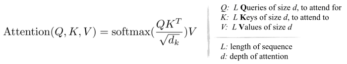

Before we get into what self-supervised attention means, let’s get an intuition of optical flow estimation and how it serves as an approach for tracking objects by both humans and computer vision systems.
 
------

It is a consensus that object tracking is a fundamental ability that is developed by a human baby at an early age of about two to three months. However, at the level of neurophysiology, the actual working mechanism of the human visual system still remains somewhat obscure. Similar to the human visual system, computer vision systems also widely use tracking for various applications like video surveillance and autonomous driving. The objective of a tracking algorithm is to relocate a particular set of objects in a given video sequence that it has identified in the initial frames. In the research literature related to tracking, it is studied under two major categories namely Visual Object Tracking (VOT) and Semisupervised Video Object Segmentation (Semi-VOS). The first one (VOT) aims to track objects by relocalizing object bounding boxes throughout the video sequence. Whereas the latter (Semi-VOS) tracks objects at a more fine-grained level through a pixel-level segmentation mask. In this blog, we will discuss the original idea behind the latter approach i.e Dense Optical Flow Estimation and how this kind of dense tracking approach is achieved through self-supervised attention mechanisms.

## Dense Optical Flow Estimation
Dense optical flow is one of the categories of the concept of Optical flow. Optical flow can be defined as the motion of objects between consecutive frames of a video sequence, as a consequence of relative motion between the object and camera. To explain the same in a scientific language, we can say that optical flow is the distribution of apparent velocities of movement of brightness patterns in an image that arises from the relative motion of objects and the viewer. Optical flow is studied as Sparse optical flow and Dense optical flow. Sparse optical flow derives flow vectors of only a few interesting pixels in the frame that either depict some edge or corner of an object. On the other hand, Dense optical flow derives flow vectors of all the pixels in a given frame, thus giving a higher accuracy at the cost of more computation and less speed.


Dense optical flow computes one optical flow vector per pixel for every frame in the video sequence. Unlike sparse optical flow, this approach gives a more suitable output for applications such as video segmentation and structural learning from motion. Dense optical flow can be implemented by various methods. Among them, one of the simplest to use algorithm is the Farneback method. It is based on Gunner Farneback’s algorithm which is explained in “Two-Frame Motion Estimation Based on Polynomial Expansion” by Gunner Farneback in 2003. OpenCV provides the code function to this algorithm to find the dense optical flow. For a quick experience of what Farneback’s algorithm is, run the following code snippet.

```jsx
import cv2
import numpy as np
from glob import glob
import requests 
import os

def get_video(video_url):
  r = requests.get(video_url, stream = True) 
  with open('./vid.mp4', 'wb') as f: 
    for chunk in r.iter_content(chunk_size = 1024*1024): 
      if chunk: 
        f.write(chunk)

def estimate_optical_flow(video, frame_dir):
  ret, frame1 = video.read()
  prvs = cv2.cvtColor(frame1,cv2.COLOR_BGR2GRAY)
  hsv = np.zeros_like(frame1)
  hsv[...,1] = 255
  seq = 1
  while(1):
    ret, frame2 = video.read()
    next = cv2.cvtColor(frame2,cv2.COLOR_BGR2GRAY)

    flow = cv2.calcOpticalFlowFarneback(prvs,next, None, 0.5, 3, 15, 3, 5, 1.2, 0)

    mag, ang = cv2.cartToPolar(flow[...,0], flow[...,1])
    hsv[...,0] = ang*180/np.pi/2
    hsv[...,2] = cv2.normalize(mag,None,0,255,cv2.NORM_MINMAX)
    rgb = cv2.cvtColor(hsv,cv2.COLOR_HSV2BGR)

    cv2.imwrite(f"{frame_dir}/{seq}.png",rgb)
    seq+=1
    if seq==200:
      break
  video.release()

def generate_output(frame_dir):
  img_array = []
  for filename in sorted(glob(f"{frame_dir}/*.png")):
    img = cv2.imread(filename)
    height, width, layers = img.shape
    size = (width,height)
    img_array.append(img)
    
  fourcc = cv2.VideoWriter_fourcc(*'mp4v')
  out = cv2.VideoWriter('./Dense-optical-flow.mp4', fourcc, 20.0, size)
  
  for i in range(len(img_array)):
    out.write(img_array[i])
  out.release()

def main():
  video_url = "https://viratdata.org/video/VIRAT_S_010204_05_000856_000890.mp4"
  get_video(video_url)
  video = cv2.VideoCapture("./vid.mp4")
  if not os.path.exists('./frames'):
    os.mkdir('./frames')
  estimate_optical_flow(video, './frames')
  generate_output('./frames')

if __name__ == "__main__":
  main()
```
After running the above code, you will get the following output (right side) in a video(Dense-optical-flow.mp4)


The Farneback algorithm is an effective technique to estimate the motion of certain image features by comparing two consecutive frames from a video sequence. The algorithm first uses the polynomial expansion transform to approximate the windows of image frames through the quadratic polynomials. Polynomial expansion transform is a signal transform designed exclusively in the spatial domain and can be used for signals of any dimensionality. The method observes the translation of the polynomial transforms to estimate displacement fields from polynomial expansion coefficients. This method then computes the dense optical flow after a series of iterative refinements. In the implementation code, the algorithm computes the direction and magnitude of optical flow from a two-channel array of flow vectors (dx/dt, dy/dt). The computed direction and magnitude are then visualized by the value of HSV color representation which is set to a maximum of 255 for optimal visibility.

## Deep Learning for Dense Optical Flow Estimation
Historically, the problem of optical flow is an optimization problem. After the recent developments in deep learning, many researchers have applied deep learning to solve this optimization problem by processing consecutive video frames as input to calculate the optical flow of the object in motion. Although these approaches just process two consecutive frames at a time, still the essence of a video is captured in these two frames. The main thing that distinguishes videos from images is that videos possess a temporal structure in addition to the spatial structure of the images. However, videos also have other modalities such as sound, but they are of no use in this case. Therefore consecutive frame stream can be interpreted as a collection of images operating in a specific temporal resolution (fps). This means that data in a video is encoded not only spatially but also sequentially, which makes classifying videos quite interesting and yet challenging at the same time.

Generally, deep neural networks require a large amount of training data to learn and optimize the approximation functions. But in the case of optical flow estimation, training data is particularly hard to obtain. The major reason behind this is the difficulty of accurately labeling video footage for the exact motion of every point of an image to subpixel accuracy. Therefore to address the issue of labeling video data, computer graphics are used to simulate massive realistic worlds through instructions. As the instructions are known, the motion of every pixel in the video frame sequence is already known. Some of the recent research that attempts to solve the optical flow problems are PWC-Nets, ADLAB-PRFlow, and FlowNet. Optical flow is widely inherited by many applications like vehicle tracking and traffic analysis through object detection and multi-object tracking by feature-based optical flow techniques from either from a stationary camera or cameras attached to vehicles.
## Self-Supervised Deep Learning for Tracking
As mentioned earlier, visual tracking is integral for many tasks like recognition, interaction, and geometry under the domain of video analysis. But at the same time using deep learning for these tasks becomes infeasible due to the huge requirement of labeled video data. Anyway, to achieve high performance, large-scale tracking datasets become necessary which in turn requires extensive efforts and thus makes the deep learning approach more impractical and expensive. Keeping this in mind, recent researchers have put their faith in a promising approach to make the machines learn without human supervision (labeled data) by leveraging large amounts of unlabeled and raw video data. This quest for self-supervised learning started with a research proposal from the Google research team that suggested to make a visual tracking system by training a model on a proxy task of video colorization that doesn’t require any additional labeled data (self-supervision). However, the research suggested that instead of making the model predict the color of the input grayscale frame, it must learn to copy the colors from a set of reference frame, thus leading to the rise of a pointing mechanism that is able to track the spatial feature of a video sequence in a temporal setup. Visualizations and experiments of these self-supervised methods suggest that, although the network is trained without any human supervision, a mechanism for visual feature tracking automatically emerges inside the network. After plenty of training on unlabeled video collected from the internet, the self-supervised model was able to track any segmented region specified in the initial frame of the video frame sequence. However, the self-supervised deep learning methods are trained on an assumption that the color in the frame sequence is temporally stable. Clearly, there are exceptions, like colorful lights can turn on and off in the video.

The objective of self-supervised learning in tracking is to learn feature embedding that is suitable for matching correspondences along the frame sequence of a video. The correspondence flow is learned by exploiting the natural spatial-temporal coherence in the frame sequence. Correspondence flow can be understood as the feature similarity flow existing between consecutive frames. In simple language, this approach learns a pointer mechanism that can reconstruct a target image by copying pixel information from a set of reference frames. Therefore to make such a model, there are certain precautions a researcher must keep in mind while designing the architecture. First, we must prevent the model from learning trivial solution of this task ( e.g. matching consecutive frames based on low-level color features). Second, we must make the tracker drifting less severe. Tracker drifting (TD) is mainly caused due to occlusion of objects, complex object deformation, and random illumination changes. TD is usually handled by training recursive models over long temporal windows with cycle consistency and scheduled sampling.

Finally, before we look under the hood of this pointer mechanism, let’s cover some of the above-mentioned points that one must consider while designing such models. First, it’s important to remember that correspondence matching is the fundamental building block of these models. Therefore there is a high probability that the model will learn a trivial solution while doing frame reconstruction by pixel-wise matching. To prevent the model from overfitting on a trivial solution, it is important to add color jittering and channel-wise dropout, so that model is forced to rely on low-level color information and must be robust to any kind of color jittering. Lastly, to handle TD, as suggested earlier, recursive training over long temporal windows with forward-backward consistency and scheduled sampling is the best way to alleviate the tracker drifting problem. If we apply the above-mentioned methods, we can be sure that the model robustness will increase and the approach will be able to exploit the spatial-temporal coherence of the video and colors will be able to act as a reliable supervision signal for learning correspondences.
## Self-supervised Attention under the Hood
If you look deeper into what actually is the pointer mechanism that is being learned here, you will come to the conclusion that it is a type of attention mechanism. Yes, it’s ultimately the famous trio of QKV (Query-Key-Value, the basis of most attention mechanisms).

As we know, the goal of the self-supervised model is to learn robust correspondence matching by effectively encoding feature representations. In simple language, the ability to copy effectively is achieved by training on a proxy task, where the model learns to reconstruct a target frame by linearly combining pixel data from the reference frames, with the weights measuring the strength of correspondence between pixels. However, breaking down this process, we find that there is a triplet (Q, K, V) for every input frame we process. The Q, K, V refer to Query, Key, and Value. To reconstruct a pixel I¹ in the T¹ frame, an Attention mechanism is used for copying pixels from a subset of previous frames in the original sequence. Just, in this case, the query vector (Q) is the present frame’s(I¹) feature embedding (target frame), the key Vector is the previous frame’s(I⁰) feature embedding (reference frame). Now if we compute a dot product (.) between the query and key (Q.K) and take a softmax of the computed product, we can get a similarity between the present frame ( I¹ ) and the previous reference frame (I⁰). This computed similarity matrix when multiplied with a reference instance segmentation mask (V) during inference will give us a pointer for our target frame, thus achieving dense optical flow estimation. Therefore this pointer which is just a combination of Q, K, and V is the actual attention mechanism working under the hood of this self-supervised system.
A key element in attention mechanism training is to establish a proper information bottleneck. To circumvent any learning shortcuts that the attention mechanism may resort to, the previously mentioned techniques of intentionally dropping the input color information and channel dropout are used. However, the choice of color spaces still plays an important role in training these attention mechanisms through self-supervision. Many research works have validated the conjecture that using decorrelated color space leads to better feature representations for self-supervised dense optical flow estimation. In simple language, using the LAB format image works better than the RGB format. This is because all RGB channels include a representation of brightness, making it highly correlate to the luminance in Lab, therefore acting as a weak information bottleneck.
## Restricted Attention for minimizing physical memory costs
The above-proposed attention mechanism usually comes with high physical memory cost. Therefore processing high-resolution information for correspondence matching can lead to large memory requirements and slower speed.

To circumvent the memory cost, ROI localization is used to estimate the candidate windows non-locally from memory banks. Intuitively, we can say that for temporally close frames, spatial-temporal coherence naturally exists in the frame sequence. This ROI localization leads to restricted attention as now the pixel in the target frame is only compared to spatially neighboring pixels of the reference frame. The number of comparable pixels is determined by the size of the dilated window in which the attention is restricted. The dilation rate of the window is proportional to the temporal distance between the present frame and the past frames in the memory bank. After computing the affinity matrix of the restricted attention region, fine-grained matching scores can be computed in a non-local manner. Therefore, with the proposed memory-augmented restricted attention mechanism, the model can efficiently process high-resolution information without incurring large physical memory costs.
## Conclusion
In this blog, we started with an introduction to the concept of optical flow and studied its application in object tracking. We also studied how this concept inspired the deep learning tracking systems and how self-supervision and visual attention plays a key role in making these systems. The computed optical flow vectors open a myriad of possible applications that require such an in-depth scene understanding of videos. The discussed techniques are majorly applied to pedestrian tracking, autonomous vehicle navigation, and many more novel applications. The variety of applications where the optical flow can be applied is only limited by the ingenuity of its designers.
In my personal opinion, self-supervision will soon serve as a strong competitor to its supervised counterpart because of its generalizability and flexibility. Self-supervision easily outperforms most of the supervised methods on unseen object categories, which reflects its importance and power in the coming time as we take our steps towards solving human intelligence.
My blogs are a reflection of what I worked on and simply convey my understanding of these topics. My interpretation of deep learning can be different from that of yours, but my interpretation can only be as inerrant as I am.

### Read more 📖

- [Blog](https://rishab.co/blog)

🙏 Thanks for reading! hope you liked the post.
Have a nice day bye! 👋

*Comment down if you want to know more*